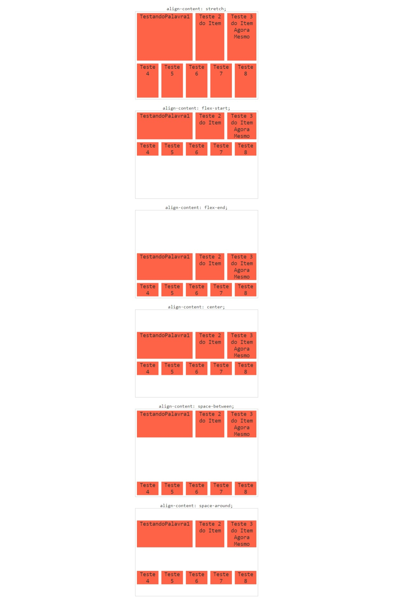

# align-content

Alinha as linhas do container em relação ao eixo vertical. A propriedade só funciona se existir mais de uma linha de flex-itens. Para isso o flex-wrap precisa ser wrap.

Além disso o efeito dela apenas será visualizado caso o container seja maior que a soma das linhas dos itens. Isso significa que se você não definir height para o container, a propriedade não influencia no layout.

- align-content: stretch;

Valor padrão, ele que faz com que os flex itens cresçam igualmente na vertical.

- align-content: flex-start;

Alinha todas as linhas de itens ao início.

- align-content: flex-end;

Alinha todas as linhas de itens ao final.

- align-content: center;

Alinha todas as linhas de itens ao centro.

- align-content: space-between;

Cria um espaçamento igual entre as linhas. Mantendo a primeira grudada no topo e a última no bottom.

- align-content: space-around;

Cria um espaçamento entre as linhas. Os espaçaamentos são iguais e o centro é o centro dos itens.

