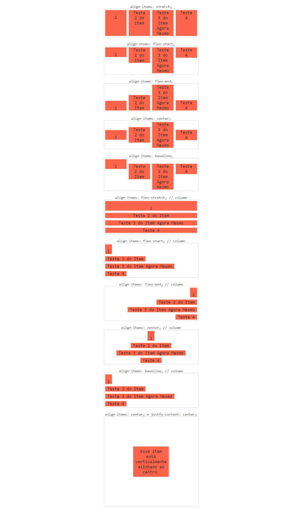

# Align items

O align-items alinha os flex itens de acordo com o eixo do container. O alinhamento é diferente para quando os itens estão em colunas ou linhas.

Essa propriedade permite o tão sonhado alinhamento central no eixo vertical, algo que antes só era possível com diferent

- align-itens: stretch;

Valor padrão, ele que faz com que os flex itens cresçam igualmente.

- align-itens: center;

Alinha os itens ao centro do container.

- align-itens: baseline;

Alinha os itens de acordo com a linha base da tipografia.

- align-itens: flex-start;

Ação de alinhar os itens ao início do container.

- align-itens: flex-end;

Alinha os itens ao final do container.

