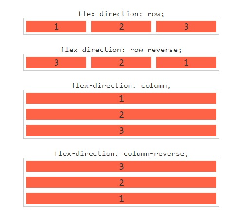

# Flexbox
 ## `flex-direction: row, row-reverse, column e column-reverse`
- `flex-direction: row`

Os itens ficam em linha

- `flex-direction: row-reverse`

Os itens ficam em linha reversa, ou seja 3, 2, 1.

- `flex-direction: column`

Os itens ficam em uma única coluna, um embaixo do outro.

- `flex-direction: column-reverse`

Os itens ficam em uma única coluna, um embaixo do outro, porém em ordem reversa: 3, 2 e 1.
 

 