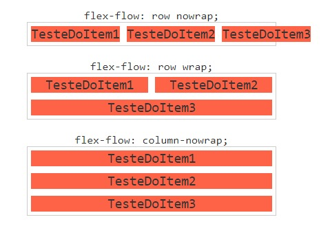

# Flexbox
## `flex-flow`
O flex-flow é um atalho para as propriedades flex-direction e flex-wrap. Você não verá muito o seu uso, pois geralmente quando mudamos o flex-direction para column, mantemos o padrão do flex-wrap que é nowrap.

E quando mudamos o flex-wrap para wrap, mantemos o padrão do flex-direction que é row.

- `flex-flow: row nowrap`

Coloca o conteúdo em linha e não permite a quebra de linha.

- `flex-flow: row wrap`

Coloca o conteúdo em linha e permite a quebra de linha.

- `flex-flow: column nowrap`

Coloca o conteúdo em coluna e não permite a quebra de linha.

