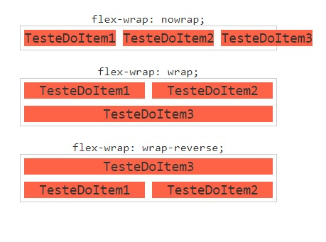

#  Flexbox
## `flex-wrap`

Define se os itens devem quebrar ou não a linha. Por padrão eles não quebram linha, isso faz com que os flex itens sejam compactados além do limite do conteúdo.

Essa é geralmente uma propriedade que é quase sempre definida como flex-wrap: wrap; Pois assim quando um dos flex itens atinge o limite do conteúdo, o último item passa para a coluna debaixo e assim por diante

- `flex-wrap: nowwrap`

 Valor padrão, não permite a quebra de linha.

- `flex-wrap: wrap`

Quebra a linha assim que um dos flex itens não puder mais ser compactado.

- `flex-wrap: wrap-reverse`

 Quebra a linha assim que um dos flex itens não puder mais ser compactado. A quebra é na direção contrária, ou seja para a linha acima.

 