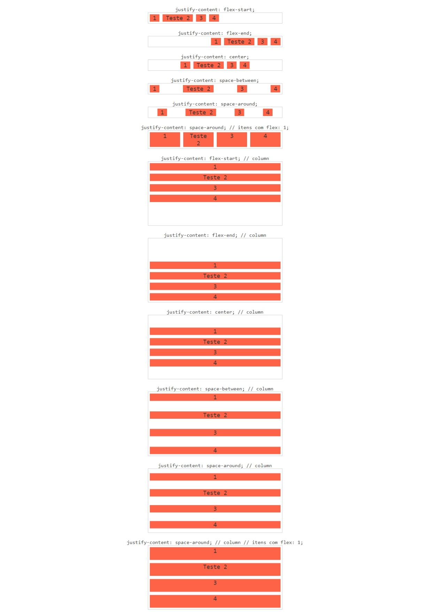

#  Flexbox
## `justify-content`

Alinha os itens flex no container de acordo com a direção. A propriedade só funciona se os itens atuais não ocuparem todo o container. Isso significa que ao definir flex: 1; ou algo similar nos itens, a propriedade não terá mais função

Excelente propriedade para ser usada em casos que você deseja alinhar um item na ponta esquerda e outro na direita, como em um simples header com marca e navegação.

- `justify-content: flex-start`

Alinha os items ao inicio do container.

- `justify-content: flex-end`

Alinha os itens ao final do container.

- `justify-content: center`

Alinha os itens no centro do container.
- `justify-content: space-between`

Cria um espaçamento igual entre os elementos. Mantendo o primeiro grudado ao inicio e o último ao final do container.

- `justify-content: space-around`

Cria um espaçamento entre os elementos. Os espaçamentos do meio são duas vezes maiores que o inicial e final.

